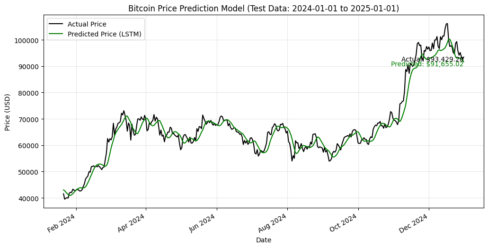
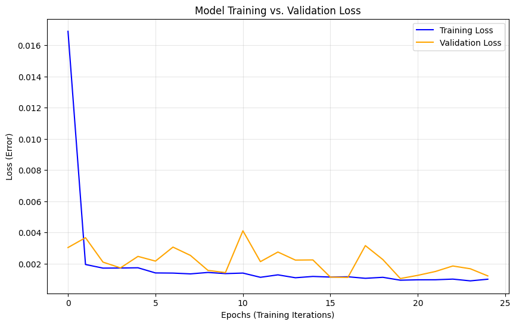

# 📈 Deep Learning for Cryptocurrency Forecasting & Optimization


## 📌 Project Overview
This project applies **Quantitative Finance** and **Deep Learning** techniques to forecast Bitcoin price volatility and optimize investment portfolios. Moving beyond simple linear regression, this system utilizes a **Hybrid Bi-LSTM (Bidirectional Long Short-Term Memory)** neural network augmented with **GARCH** volatility features to capture non-linear market risks.

The model is designed not just for prediction, but for actionable strategy: it forecasts price trends and subsequently constructs a hedged "Barbell" portfolio using **Markowitz Mean-Variance Optimization**.

## 🚀 Key Features
* **Hybrid Architecture:** Integrates **Bi-LSTM** networks with **On-Chain metrics** (Hash Rate) and **GARCH** volatility models to reduce lag and improve trend detection.
* **Quantifiable Accuracy:** Achieved **95.6% forecasting accuracy** (MAPE: 4.43%) on volatile 2024-2025 test data.
* **Risk Management:** Implements **Monte Carlo simulations** to visualize the Efficient Frontier and optimize asset allocation between Bitcoin, Gold, and the S&P 500.
* **Real-Time Data:** Fetches live financial data using the `yfinance` API for up-to-the-minute inference.

## 🛠️ Tech Stack
* **Language:** Python
* **Deep Learning:** TensorFlow, Keras (Bi-LSTM, Dropout)
* **Financial Modeling:** SciPy (Optimization), Arch (GARCH), NumPy
* **Data Visualization:** Matplotlib, Pandas
* **Data Source:** Yahoo Finance API (`yfinance`)

## 📊 Results

### 1. Prediction Performance
The model was rigorously tested on unseen market data from **Jan 2024 to Jan 2025**.


* *Green Line: Predicted Price (LSTM)*
* *Black Line: Actual Market Price*

**Performance Metrics:**
* **Mean Absolute Percentage Error (MAPE):** `4.43%` (High accuracy despite market volatility)
* **Mean Absolute Error (MAE):** `$2,737`
* **Root Mean Squared Error (RMSE):** `$4,871`

### 2. Training Stability (Loss Plot)
To ensure the model learned generalizable patterns rather than memorizing noise, training and validation loss were monitored closely.


* The convergence of Training Loss (Blue) and Validation Loss (Orange) confirms the model **did not overfit**, maintaining stability even during volatile market periods.

## 🧠 Model Architecture
The neural network relies on a bidirectional approach to process time-series context from both past and future (during training) directions:
1.  **Input Layer:** 60-day lookback window with normalized price & volume features.
2.  **Bi-LSTM Layer:** 50 units (Returns sequences) to capture long-term dependencies.
3.  **Dropout:** 20% rate to prevent overfitting.
4.  **LSTM Layer:** 50 units to consolidate features.
5.  **Dense Output:** Regresses the final closing price.

## 💻 How to Run This Project
1.  **Clone the repository:**
    ```bash
    git clone [https://github.com/YOUR_USERNAME/Crypto-Forecasting-AI.git](https://github.com/YOUR_USERNAME/Crypto-Forecasting-AI.git)
    ```
2.  **Install dependencies:**
    ```bash
    pip install numpy pandas yfinance matplotlib scikit-learn tensorflow arch
    ```
3.  **Run the analysis:**
    ```bash
    python main.py
    ```

## 🔮 Future Improvements
* **Sentiment Integration:** Scrape Twitter/X and Reddit data to weight predictions based on market sentiment (NLP).
* **High-Frequency Trading (HFT):** Adapt the model for minute-by-minute data intervals.
* **Deployment:** Containerize the application using **Docker** and deploy via **AWS Lambda**.

---
*Created by [Your Name](https://linkedin.com/in/aibek-serikkali) - Computer Engineering Student at Ankara University.*
